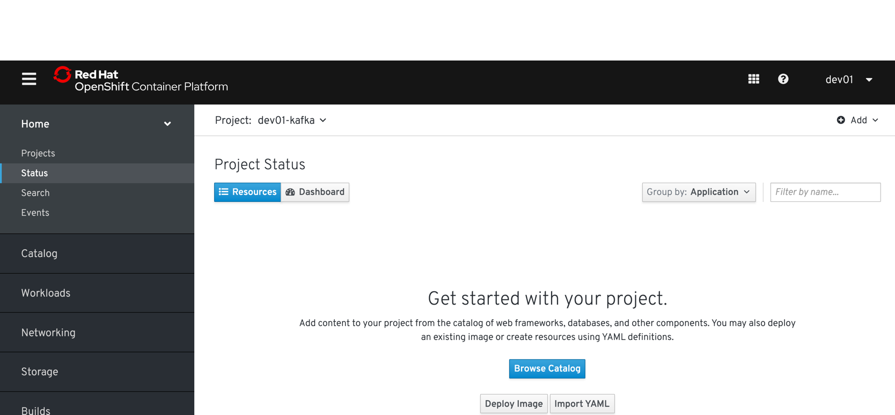
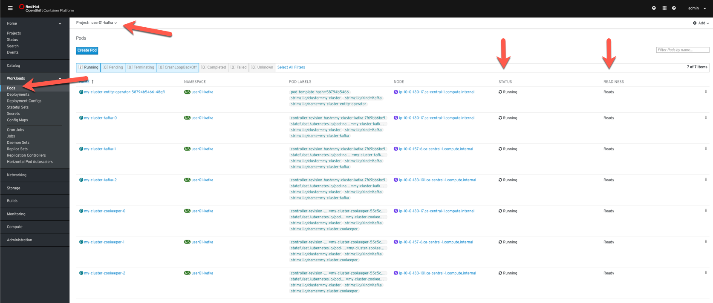
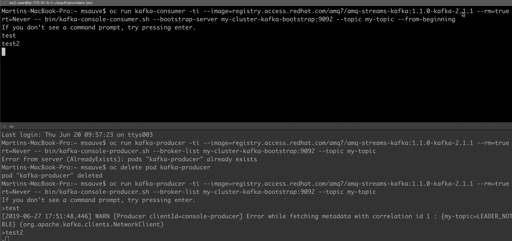

## Installing a Kafka Cluster with the AMQ Streams Operator

#### STEP 1:  OpenShift Cluster Connection

Connection to the OpenShift cluster with the user and password provided during the workshop.


#### STEP 2:  Creating a Kafka Cluster

The AMQ Streams operator has been installed by the cluster administrator and is available for your project.

In the userXX-Kafka project, from the catalog, add a Kafka cluster ("Browse Catalog" button)



Choose the 'Kafka' option


Create a Kafka cluster ("Create" button)


Examine the YAML file. This file is used by the operator to configure and install the Kafka cluster.


1. Cluster name and project in which it will be installed.
2. Definition of the 'listeners' that will be deployed (internal to the cluster, external, encryption or not) and number of   Kafka brokers
3. Storage type for Kafka (for the lab - ephemeral storage in the container)
4. Number of replicas for the Zookeeper and storage type for the Zookeeper
5. Additional operators to deploy


For the lab, the default settings will be used

To create the cluster, use the "Create" button

The AMQ Streams opeator starts the process of creating your Kafka cluster:


Wait for the Kafka cluster to start.  



To validate the cluster status, in the OpenShift console, select the Pod menu in your project (userXX-kafka). Wait for the 7 pods of the Kafka cluster to be 'Running' and 'Ready'

or with the command line tool oc:
```
oc get pods -w -n kafka-devXX
```

#### STEP 3:  Validation of the installation

The Kafka tools available with the standard Kafka distribution are available as a container in the Red Hat Registry to run on OpenShift.

With the OpenShift client, start in two different windows a producer and a consumer:

Producer:

```
oc project userXX-kafka

oc run kafka-producer -ti --image=registry.access.redhat.com/amq7/amq-streams-kafka:1.1.0-kafka-2.1.1 --rm=true --restart=Never -- bin/kafka-console-producer.sh --broker-list my-cluster-kafka-bootstrap:9092 --topic my-topic 
```


Consumer:
```
oc run kafka-consumer -ti --image=registry.access.redhat.com/amq7/amq-streams-kafka:1.1.0-kafka-2.1.1 --rm=true --restart=Never -- bin/kafka-console-consumer.sh --bootstrap-server my-cluster-kafka-bootstrap:9092 --topic my-topic --from-beginning
```

The producer is a producer "console", a Kafka client that sends all messages to enter the console in a kafka topic. Enter a message in the producer's console, the message should be displayed in the consumer window.




