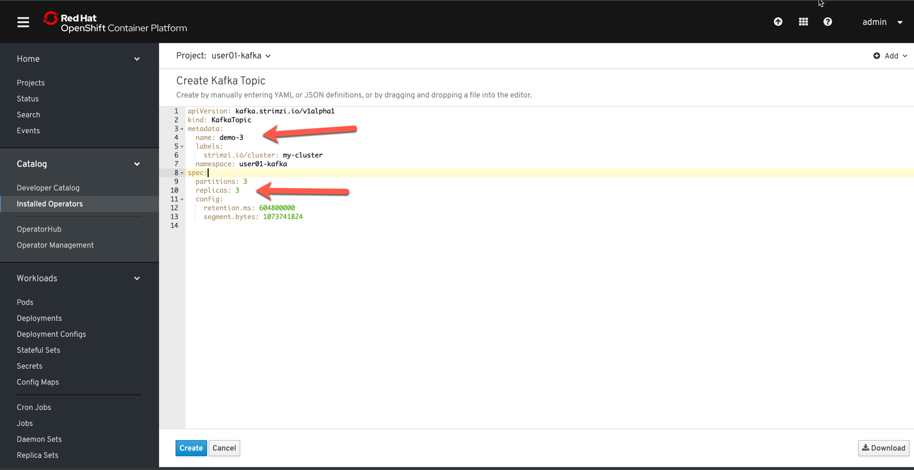

## Réplication Kafka

#### Étape 1:  Création du Topic Kafka

En utilisant l'operator AMQ Streams, créer un topic Kafka nommer "demo-2" avec 3 partitions et 3 replicas:

Dans la console OpenShift

1) Sélectionner le project userXX-kafka
2) Sélectionner "Installed Operators" dans le menu de gauche
3) Créer un nouveau Topic avec le bouton "Create New"


Dans la page de configuration du topic, utiliser les paramêtres suivants:
* name:  demo-3
* partitions: 3
* replicas: 3



Le nouveau Topic demo-3 apparait dans la liste des topics disponible. 


Pour valider la configuration du topic dans le zookeeper, utiliser la commande suivante:

```
oc exec my-cluster-zookeeper-0 -it -- bin/kafka-topics.sh --zookeeper localhost:21810  --describe --topic demo-3
```


Les colonnes suivantes sont affichées:
* Leader - l'identificateur du broker Kafka qui va servir toutes les requêtes pour une partition donnée.
* Replicas - l'ordre de réplication d'une partition sur les autres brokers.
* ISR - In-Sync Replicas - Les brokers à jour dans les messages pour une partition donnée (replication complétée)


#### Étape 2: Réplication 

Publier 20 messages dans le topic demo-2 avec l'utilisation kafka-verifiable-producer, les messages sont publiés avec un index ordonnancé de 0 à 20 :

```
oc run kafka-producer -ti --image=registry.access.redhat.com/amq7/amq-streams-kafka:1.1.0-kafka-2.1.1 --rm=true --restart=Never -- bin/kafka-verifiable-producer.sh --broker-list my-cluster-kafka-bootstrap:9092 --topic demo-3 --max-messages 20
```

Valider que les messages sont persistés et disponible dans le cluster.

```
 oc run kafka-consumer -ti --image=registry.access.redhat.com/amq7/amq-streams-kafka:1.1.0-kafka-2.1.1 --rm=true --restart=Never -- bin/kafka-console-consumer.sh --bootstrap-server my-cluster-kafka-bootstrap:9092 --topic demo-3 --from-beginning
 ```

 Simuler une panne en détruisant un des brokers:
```
oc delete pod my-cluster-kafka-0
```

Valider que les messages sont persistés et toujours disponible dans le cluster.

```
 oc run kafka-consumer -ti --image=registry.access.redhat.com/amq7/amq-streams-kafka:1.1.0-kafka-2.1.1 --rm=true --restart=Never -- bin/kafka-console-consumer.sh --bootstrap-server my-cluster-kafka-bootstrap:9092 --topic demo-3 --from-beginning
 ```

Valider la nouvelle configuration des brokers:


```
oc exec my-cluster-zookeeper-0 -it -- bin/kafka-topics.sh --zookeeper localhost:21810  --describe --topic demo-3
```

Les Leaders et Replicas ont changé

