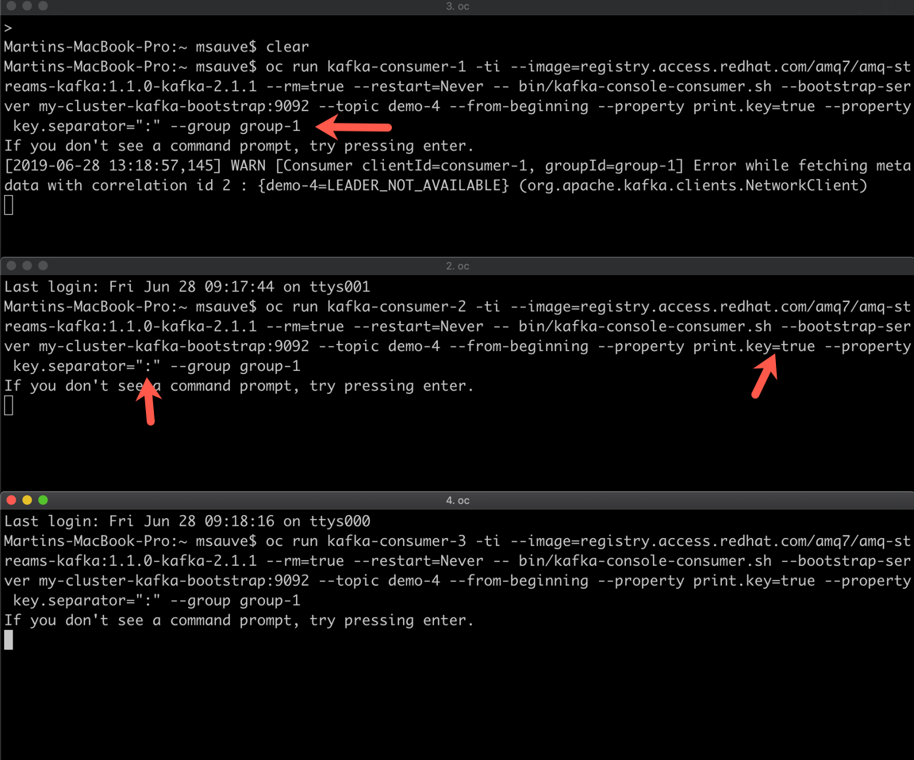

## Partitions, Replication and "Consumer Groups" Kafka

#### Step 1: Creating the Kafka Topic

Using the AMQ Streams operator, create a Kafka topic named "demo-4" with 3 partitions and 3 replicas:

In the OpenShift consolet

1) Select project userXX-kafka
2) Select "Installed Operators" in the left menu
3) Create a new Topic with the "Create New" button


In the topic configuration page, use the following settings:
* name:  demo-4
* partitions: 3
* replicas: 3

The new Topic demo-4 appears in the list of available topics.


####  Consumers and Consumer Groups

Open four different "terminal" windows.

In windows 1 to 3, start 3 Kafka Consumers in the same Consumer Group:

```
oc run kafka-consumer-1 -ti --image=registry.access.redhat.com/amq7/amq-streams-kafka:1.1.0-kafka-2.1.1 --rm=true --restart=Never -- bin/kafka-console-consumer.sh --bootstrap-server my-cluster-kafka-bootstrap:9092 --topic demo-4 --from-beginning --property print.key=true --property key.separator=":" --group group-1
```

```
oc run kafka-consumer-2 -ti --image=registry.access.redhat.com/amq7/amq-streams-kafka:1.1.0-kafka-2.1.1 --rm=true --restart=Never -- bin/kafka-console-consumer.sh --bootstrap-server my-cluster-kafka-bootstrap:9092 --topic demo-4 --from-beginning --property print.key=true --property key.separator=":" --group group-1
```

```
oc run kafka-consumer-3 -ti --image=registry.access.redhat.com/amq7/amq-streams-kafka:1.1.0-kafka-2.1.1 --rm=true --restart=Never -- bin/kafka-console-consumer.sh --bootstrap-server my-cluster-kafka-bootstrap:9092 --topic demo-4 --from-beginning --property print.key=true --property key.separator=":" --group group-1
```



In the previous picture:

* Group: Consumer Group Kafka's identifier for the customer
* key.separator: the client expects to receive messages indexed with ":" as a separator between the index and the content
* print.key: the key and the contents will be displayed.

Open a fourth "terminal" window and start a consumer from another Kafka consumer group:

```
oc run kafka-consumer-g2 -ti --image=registry.access.redhat.com/amq7/amq-streams-kafka:1.1.0-kafka-2.1.1 --rm=true --restart=Never -- bin/kafka-console-consumer.sh --bootstrap-server my-cluster-kafka-bootstrap:9092 --topic demo-4 --from-beginning --property print.key=true --property key.separator=":" --group group-2
```

In summary:

* Consumer Group "group-1" has three consumers to deploy
* onsumer Group "group-2" has a consumer to deploy

#### Étape 3: Messages et Index

Step 3: Messages and Index

```
oc run kafka-producer -ti --image=registry.access.redhat.com/amq7/amq-streams-kafka:1.1.0-kafka-2.1.1 --rm=true --restart=Never -- bin/kafka-console-producer.sh --broker-list my-cluster-kafka-bootstrap:9092 --topic demo-4  --property parse.key=true --property key.separator=":"
```

Send the following messages (1 by 1)

* 1:{"Brand":"Honda", "Modeles":["Civic","Accord","Odyssey"]}
* 1:{"Brand":"Volkswagen", "Modeles":["Golf","Tiguan","Jetta"]}
* 2:{"Brand":"Tesla", "Modeles":["S","X","3"]}
* 3:{"Brand":"Toyota", "Modeles":["Camry","Corolla"]}
* Your creation! - Json with index and separator:

Obtaining the results, the messages of the same index should be on the same client of a consumer group.


