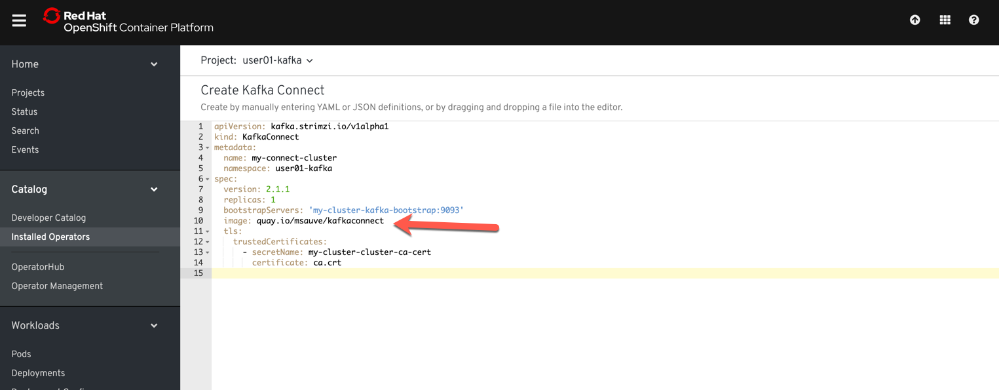
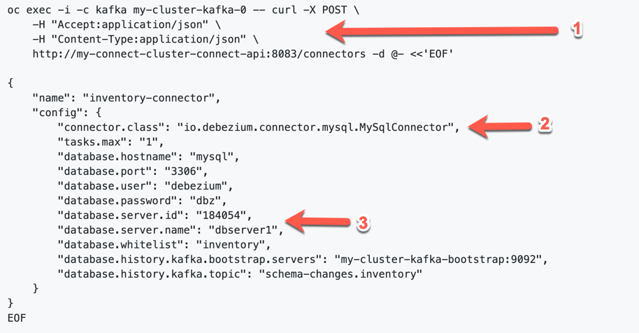

## Kafka Connect

#### Étape 1:  Création du Cluster Kafka Connect

En utilisant l'operator AMQ Streams, créer un cluster Kafka Connect:


Dans la spécification YAML de votre cluster Kafka Connect, ajouter la source de l'image du conteneur.
Des plugins nécessaires à cet exercice ont été ajouté à la configuration de Kafka Connect. Attention au espace, ils sont important

```
  image: quay.io/msauve/kafkaconnect
```



Créer le Cluster Kafka-Connect et attender que le pod soit prêt et déployé.


#### Étape 2: Installation d'une base de données


oc new-app --name=mysql debezium/example-mysql:0.9

oc set env dc/mysql MYSQL_ROOT_PASSWORD=debezium  MYSQL_USER=mysqluser MYSQL_PASSWORD=mysqlpw


#### Étape 3 : Création d'un connecteur avec l'API Kafka Connect

Exécuter le script suivant (MacOS, Bash ou Linux) dans une fenêtre "Terminal" pour créer une source d'événements Kafka-Connect.

```
oc exec -i -c kafka my-cluster-kafka-0 -- curl -X POST \
    -H "Accept:application/json" \
    -H "Content-Type:application/json" \
    http://my-connect-cluster-connect-api:8083/connectors -d @- <<'EOF'

{
    "name": "inventory-connector",
    "config": {
        "connector.class": "io.debezium.connector.mysql.MySqlConnector",
        "tasks.max": "1",
        "database.hostname": "mysql",
        "database.port": "3306",
        "database.user": "debezium",
        "database.password": "dbz",
        "database.server.id": "184054",
        "database.server.name": "dbserver1",
        "database.whitelist": "inventory",
        "database.history.kafka.bootstrap.servers": "my-cluster-kafka-bootstrap:9092",
        "database.history.kafka.topic": "schema-changes.inventory"
    }
}
EOF
```

Pour les environnements Windows, utiliser la procédure suivante:

```
oc rsh my-cluster-kafka-0

curl -X POST \
    -H "Accept:application/json" \
    -H "Content-Type:application/json" \
    http://my-connect-cluster-connect-api:8083/connectors -d @- <<'EOF'

{
    "name": "inventory-connector",
    "config": {
        "connector.class": "io.debezium.connector.mysql.MySqlConnector",
        "tasks.max": "1",
        "database.hostname": "mysql",
        "database.port": "3306",
        "database.user": "debezium",
        "database.password": "dbz",
        "database.server.id": "184054",
        "database.server.name": "dbserver1",
        "database.whitelist": "inventory",
        "database.history.kafka.bootstrap.servers": "my-cluster-kafka-bootstrap:9092",
        "database.history.kafka.topic": "schema-changes.inventory"
    }
}
EOF
```

##### Explication des paramêtres



* 1) Appel de l'API kafka connect à partir du broker kafka. Kafka-Connect par défaut, n'est pas exposé aux clients externes
* 2) Utilisation du plugin debezium pour MySQL
* 3) Configuration de la base de données et serveur à utiliser comme source d'événment. Les modifications et créations seront publiés dans un topic kafka indépendent pour chaque table (SERVER.DB.TABLE).


#### Étape 4 : Exécution de Kafka-Connect

Dans une fenêtre Terminal, ouvrir un consumer kafka sur le topic: dbserver1.inventory.customers   
Ce topic est automatiquement créé par Kafka Connect

```
oc run kafka-consumer -ti --image=registry.access.redhat.com/amq7/amq-streams-kafka:1.1.0-kafka-2.1.1 --rm=true --restart=Never -- bin/kafka-console-consumer.sh --bootstrap-server my-cluster-kafka-bootstrap:9092     --property print.key=true --topic dbserver1.inventory.customers --from-beginning
```

Dans la console Openshift, ouvrir un terminal à l'intérieur du Pod MySql:


* Project: userXX-kafka
* Workloads: Pods
* MySQL pod
* Terminal Tab

Dans le terminal, effectuer la connection à MySQl avec le client mysql installé dans le conteneur:

```
mysql -u mysqluser -p 
```

* password: mysqlpw

Sélectionner la base de données "Inventory":

```
use inventory;
```

Insérer des données (par example):

```
insert into customers values (null,'Martin', 'Sauve', 'me@me.com');
```


Le contenu de la BD devrait être automatiquement envoyé par Kafka-Connect sur le topic Kafka (dbserver1.inventory.customers)


