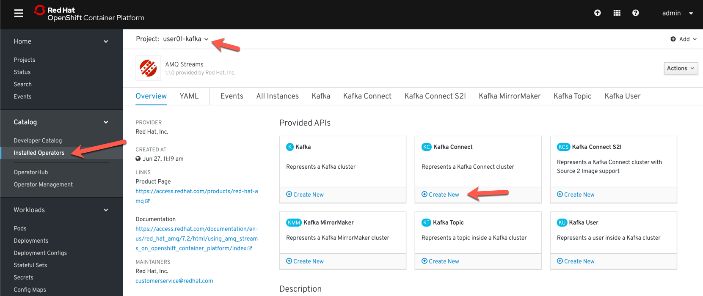
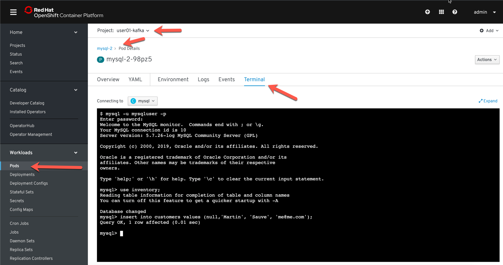
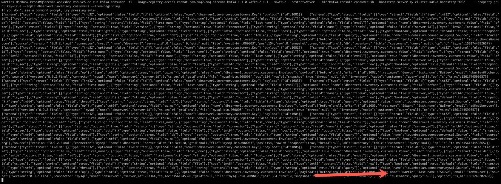

## Kafka Connect

#### Step 1: Creating the Kafka Connect Cluster

Using the AMQ Streams operator, create a Kafka Connect cluster:



In the YAML specification of your Kafka Connect cluster, add the source of the container image. Plugins needed for this exercise have been added to the Kafka Connect configuration. Attention to space, they are important

```
  image: quay.io/msauve/kafkaconnect
```


Create the Kafka-Connect Cluster and wait for the pod to be ready and deployed.


#### Step 2: Installing a database


oc new-app --name=mysql debezium/example-mysql:0.9

oc set env dc/mysql MYSQL_ROOT_PASSWORD=debezium  MYSQL_USER=mysqluser MYSQL_PASSWORD=mysqlpw


#### Step 3: Creating a connector with the Kafka Connect API

Run the following script (MacOS, Bash, or Linux) in a "Terminal" window to create a Kafka-Connect event source.

```
oc exec -i -c kafka my-cluster-kafka-0 -- curl -X POST \
    -H "Accept:application/json" \
    -H "Content-Type:application/json" \
    http://my-connect-cluster-connect-api:8083/connectors -d @- <<'EOF'

{
    "name": "inventory-connector",
    "config": {
        "connector.class": "io.debezium.connector.mysql.MySqlConnector",
        "tasks.max": "1",
        "database.hostname": "mysql",
        "database.port": "3306",
        "database.user": "debezium",
        "database.password": "dbz",
        "database.server.id": "184054",
        "database.server.name": "dbserver1",
        "database.whitelist": "inventory",
        "database.history.kafka.bootstrap.servers": "my-cluster-kafka-bootstrap:9092",
        "database.history.kafka.topic": "schema-changes.inventory"
    }
}
EOF
```

For Windows environments, use the following procedure:

```
oc rsh my-cluster-kafka-0

curl -X POST \
    -H "Accept:application/json" \
    -H "Content-Type:application/json" \
    http://my-connect-cluster-connect-api:8083/connectors -d @- <<'EOF'

{
    "name": "inventory-connector",
    "config": {
        "connector.class": "io.debezium.connector.mysql.MySqlConnector",
        "tasks.max": "1",
        "database.hostname": "mysql",
        "database.port": "3306",
        "database.user": "debezium",
        "database.password": "dbz",
        "database.server.id": "184054",
        "database.server.name": "dbserver1",
        "database.whitelist": "inventory",
        "database.history.kafka.bootstrap.servers": "my-cluster-kafka-bootstrap:9092",
        "database.history.kafka.topic": "schema-changes.inventory"
    }
}
EOF
```

##### Explanation of the parameters


* 1) Call the kafka connect API from the kafka broker. Kafka-Connect by default, is not exposed to external clients
* 2) Using the Debezium plugin for MySQL
* 3) Configuration of the database and server to use as an event source. Changes and creatives will be published in an independent kafka topic for each table (SERVER.DB.TABLE).


#### Step 4: Running Kafka-Connect

In a Terminal window, open a consumer kafka on the topic: dbserver1.inventory.customers
This topic is automatically created by Kafka Connect

```
oc run kafka-consumer -ti --image=registry.access.redhat.com/amq7/amq-streams-kafka:1.1.0-kafka-2.1.1 --rm=true --restart=Never -- bin/kafka-console-consumer.sh --bootstrap-server my-cluster-kafka-bootstrap:9092     --property print.key=true --topic dbserver1.inventory.customers --from-beginning
```

In the Openshift console, open a terminal inside the MySql Pod:



* Project: userXX-kafka
* Workloads: Pods
* MySQL pod
* Terminal Tab

In the terminal, connect to MySQl with the mysql client installed in the container:

```
mysql -u mysqluser -p 
```

* password: mysqlpw

Select the "Inventory" database:

```
use inventory;
```

Insert data (for example):

```
insert into customers values (null,'John', 'Doe', 'jdoe@me.com');
```


The contents of the comic should be automatically sent by Kafka-Connect to the Kafka topic (dbserver1.inventory.customers)



